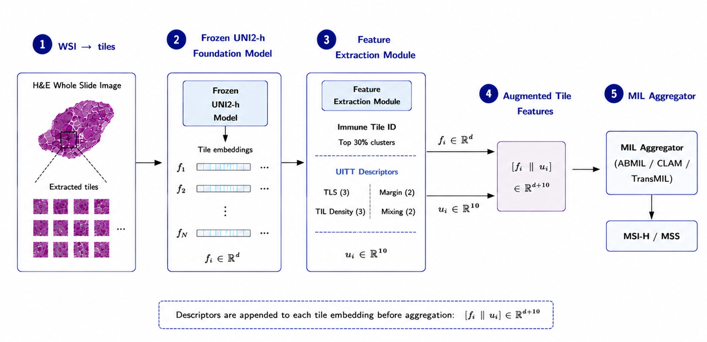
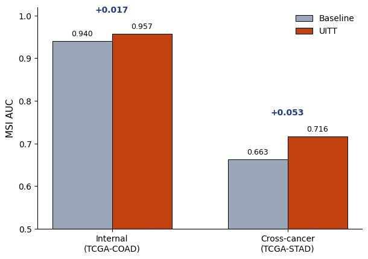
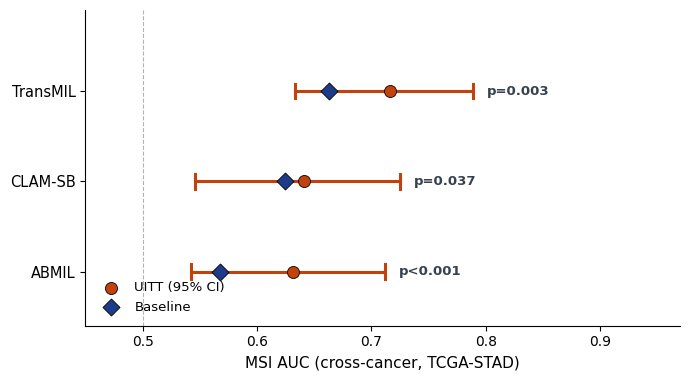
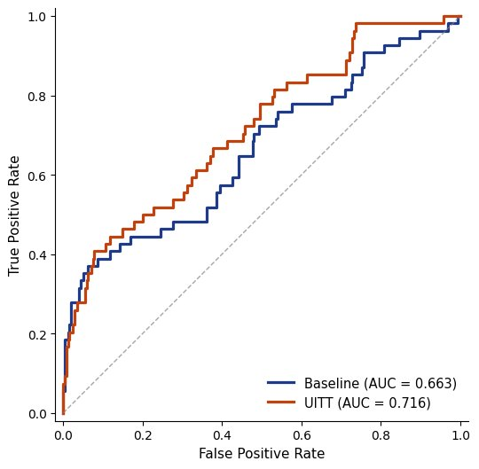

<div align="center">

# Beyond Appearance: Universal Immune-Tumor Topology

### Biologically-Grounded Spatial Priors for Zero-Shot Cross-Cancer MSI Prediction

[](https://www.python.org/)
[](https://pytorch.org/)
[](LICENSE)
[]()
[](https://drive.google.com/drive/folders/1L5e5_AE0Hsm1wKlBqfx3_KoQmvH_amne?usp=sharing)

</div>

<p align="center">
  
</p>

<p align="center">
<em>A frozen foundation model embeds each tile; UITT identifies immune-like tiles in feature space <b>without supervision</b>, computes ten spatial descriptors per tile encoding the conserved immune architecture, and appends them to the embedding before MIL aggregation. Because they encode immune <b>biology</b> rather than <b>appearance</b>, the descriptors remain informative when the cancer of origin shifts.</em>
</p>

---

## TL;DR

Foundation-model (FM) features for histopathology entangle **conserved immune biology** with **tissue-specific appearance**. A model that predicts microsatellite instability (MSI) from H&E on one cancer type therefore collapses on another. **UITT** makes the conserved part explicit: ten tissue-agnostic spatial descriptors, computed from frozen embeddings and tile coordinates with **no annotation and no target data**. Appended before multiple-instance-learning (MIL) aggregation, UITT improves zero-shot cross-cancer MSI prediction for **every** aggregator tested, with **every** improvement statistically significant, and the gain **grows** as distribution shift increases.

<div align="center">

| | |
|---|---|
| 🧬 **Setting** | Train on colorectal (TCGA-COAD), test **zero-shot** on gastric (TCGA-STAD) |
| 📈 **Headline** | TransMIL MSI AUC **0.6627 → 0.7161** (DeLong _p_ = 0.003), zero gastric labels |
| 🔬 **Why it works** | Conserved immune topology transfers where appearance-based features do not |
| ⚡ **Cost** | No retraining, no added parameters, a few seconds of CPU per slide |

</div>

> **Status.** This repository accompanies a paper currently **under review**. Code, precomputed embeddings, and results are released for reproducibility.

---

## Table of Contents

- [Method](#method)
  - [Problem setup](#problem-setup)
  - [Unsupervised immune-tile identification](#step-1--unsupervised-immune-tile-identification)
  - [The ten UITT descriptors](#step-2--the-ten-uitt-descriptors)
  - [Integration with MIL](#step-3--integration-with-mil)
- [Results](#results)
- [Installation](#installation)
- [Data](#data)
- [Reproducing the paper](#reproducing-the-paper)
- [Codebase](#codebase)
- [Notes and scope](#notes-and-scope)
- [License & citation](#license--citation)

---

## Method

### Problem setup

A whole-slide image is tiled into $N$ patches and embedded by a **frozen** foundation model $\phi$ into $\mathbf{F} \in \mathbb{R}^{N \times d}$ (with $d=1536$ for UNI2-h, $512$ for CONCH). Tile $i$ has pixel coordinate $\mathbf{c}_i = (x_i, y_i)$ in a slide of size $(W, H)$. We $\ell_2$-normalize embeddings to $\hat{\mathbf{f}}_i$ and coordinates to the unit square $\tilde{\mathbf{c}}_i = (x_i/W,\, y_i/H)$, and write $\mathcal{N}_k(i)$ for the $k$ nearest spatial neighbors of tile $i$.

UITT produces a per-tile descriptor $\mathbf{u}_i \in \mathbb{R}^{10}$, concatenated with the frozen embedding before aggregation:

$$\mathbf{f}_i' = [\,\mathbf{f}_i \,\Vert\, \mathbf{u}_i\,] \in \mathbb{R}^{d+10}.$$

The transform is deterministic given $(\mathbf{F}, \mathbf{c}, W, H)$ and an immune model fit once on the training cohort. It uses **no tile labels and no target-domain data**.

### Step 1 — Unsupervised immune-tile identification

Every descriptor is defined relative to the immune compartment, so we first identify immune-like tiles without annotation. Lymphocytes are small, round, and densely packed, far more morphologically uniform than heterogeneous tumor epithelium and stroma, and this regularity survives in embedding space as a few **tight** clusters. We fit $K$-means ($K=50$) on up to 500 tiles per slide from the **training cohort only**, and score each cluster $c$ by its tightness — the inverse mean distance of its members to the centroid $\boldsymbol{\mu}_c$:

$$\tau_c = \left( \frac{1}{|c|} \sum_{i \in c} \lVert \hat{\mathbf{f}}_i - \boldsymbol{\mu}_c \rVert_2 + \epsilon \right)^{-1}.$$

The top 30% of clusters by tightness form the immune set $\mathcal{I}$ (15 of 50 in practice). At inference each tile is assigned to its nearest cluster, yielding a binary immune indicator $m_i \in \{0, 1\}$ and a continuous immune score

$$s_i = \frac{\tau_{c(i)}}{\max_j \tau_{c(j)}} \, (1 + m_i), \qquad s_i \in [0, 1].$$

This model is fit **once** and applied unchanged to all cohorts, so no target information leaks into the descriptors — the property that makes them transfer.

### Step 2 — The ten UITT descriptors

The descriptors span four biologically-motivated groups, each grounded in a known histological correlate of MSI-high status.

<div align="center">

| Group | Biological basis | Descriptors | Dim |
|:-----:|------------------|-------------|:---:|
| **G1** | Tertiary lymphoid structures | membership, distance, size | 3 |
| **G2** | Peritumoral margin reaction (Crohn's-like) | margin distance, peri-immune band | 2 |
| **G3** | Multi-scale TIL density | density at $k = 10, 30, 100$ | 3 |
| **G4** | Immune-tumor mixing | mixing entropy, immune-epithelial ratio | 2 |

</div>

**G1 — Tertiary lymphoid structures.** Organized immune aggregates marking a mature anti-tumor response. We run DBSCAN ($\varepsilon = 0.02$, min 5 points) on immune-tile coordinates $\{\tilde{\mathbf{c}}_i : m_i = 1\}$ to obtain aggregates with centroids $\mathbf{g}_t$, then encode membership, normalized distance to the nearest aggregate, and its (normalized) size:

$$\delta^{\mathrm{TLS}}_i = \frac{\min_t \lVert \tilde{\mathbf{c}}_i - \mathbf{g}_t \rVert_2}{\max_j \min_t \lVert \tilde{\mathbf{c}}_j - \mathbf{g}_t \rVert_2}.$$

**G2 — Peritumoral margin reaction.** The dense lymphocyte band at the invasive margin (the Crohn's-like reaction) is one of the most reproducible correlates of MSI. Using local density as an interior/boundary proxy, we form a margin distance and weight it by the immune score to localize the band:

$$\delta^{\mathrm{marg}}_i = 1 - \frac{\rho_i}{\max_j \rho_j}, \qquad b_i = \frac{s_i \, \delta^{\mathrm{marg}}_i}{\max_j s_j \, \delta^{\mathrm{marg}}_j}, \qquad \rho_i = \Big(\tfrac{1}{20}\!\!\sum_{j \in \mathcal{N}_{20}(i)}\!\! \lVert \tilde{\mathbf{c}}_i - \tilde{\mathbf{c}}_j \rVert_2 + \epsilon\Big)^{-1}.$$

**G3 — Multi-scale TIL density.** MSI-high tumors carry abundant tumor-infiltrating lymphocytes throughout the tumor bed. We encode immune density at three neighborhood scales (immediate, local, regional):

$$\pi^{(k)}_i = \frac{1}{k} \sum_{j \in \mathcal{N}_k(i)} m_j, \qquad k \in \{10, 30, 100\}.$$

**G4 — Immune-tumor mixing.** A well-mixed interface reflects active engagement; segregation reflects exclusion. With local immune fraction $p_i = \tfrac{1}{20}\sum_{j \in \mathcal{N}_{20}(i)} m_j$, we use the binary mixing entropy and the immune-to-epithelial ratio:

$$e_i = -p_i \log_2 p_i - (1 - p_i)\log_2(1 - p_i), \qquad r_i = \frac{n^{\mathrm{imm}}_i}{k - n^{\mathrm{imm}}_i + 1}, \quad n^{\mathrm{imm}}_i = \!\!\sum_{j \in \mathcal{N}_{30}(i)}\!\! m_j.$$

Stacking the four groups gives $\mathbf{u}_i = [\,\delta^{\mathrm{TLS}}\text{-block} \,\Vert\, \text{margin-block} \,\Vert\, \text{TIL-block} \,\Vert\, \text{mixing-block}\,] \in \mathbb{R}^{10}$. See [`docs/uitt_method.md`](docs/uitt_method.md) for the per-column layout.

### Step 3 — Integration with MIL

The descriptor is concatenated with the frozen embedding and fed to any MIL aggregator. **No** change is made to the aggregator, loss, or hyperparameters — the only difference between a baseline and a UITT model is the ten appended dimensions, isolating the effect of the prior.

```python
from uitt import build_immune_classifier, compute_uitt_10dim
import torch

# fit the immune classifier ONCE, on the training cohort (COAD)
immune = build_immune_classifier("data/TCGA_COAD/embeddings/uni2h")

# per slide: append the 10-dim prior to the frozen embeddings
d = torch.load("data/TCGA_STAD/embeddings/uni2h/PID.pt", map_location="cpu")
uitt = compute_uitt_10dim(d["features"], d["coords"], d["slide_dims"], *immune)
x = torch.cat([d["features"], uitt], dim=1)   # [N, 1536 + 10] -> any MIL head
```

---

## Results

All models use a frozen backbone with precomputed features; only the lightweight MIL head is trained. Internal results are 5-fold stratified cross-validation; cross-cancer results are zero-shot (COAD-trained models applied to STAD with no retraining and no target labels). AUC is the primary metric given class imbalance.

### Internal — TCGA-COAD (UNI2-h)

MSI AUC, mean ± std over 5 folds. UITT is **neutral** on this near-saturated cohort, confirming the descriptors do not disturb an already-sufficient backbone; the value of the prior is reserved for transfer. **UNI2-h is the primary backbone** for all cross-cancer experiments.

<div align="center">

| Aggregator | Baseline | + UITT | Δ |
|:-----------|:--------:|:------:|:--:|
| ABMIL    | 0.9337 ± 0.0166 | 0.9348 ± 0.0197 | +0.001 |
| CLAM-SB  | 0.9469 ± 0.0233 | 0.9447 ± 0.0205 | −0.002 |
| TransMIL | 0.9398 ± 0.0274 | **0.9571 ± 0.0112** | +0.017 |

</div>

### Internal — TCGA-COAD (CONCH)

CONCH baselines for reference. CONCH + UITT is left to future work: its more compact 512-d embedding gave inconsistent cross-cohort behavior.

<div align="center">

| Aggregator | Baseline |
|:-----------|:--------:|
| ABMIL    | 0.9145 ± 0.0499 |
| CLAM-SB  | 0.9181 ± 0.0563 |
| TransMIL | 0.9198 ± 0.0615 |

</div>

### Zero-shot cross-cancer — TCGA-STAD (UNI2-h)

The central result. COAD-trained models applied to gastric cancer with **zero gastric examples**. UITT improves **every** aggregator, and **every** improvement is significant under the paired DeLong test for correlated AUCs. Parentheses give the 95% bootstrap confidence interval (1000 resamples) for the UITT AUC.

<div align="center">

| Aggregator | Baseline | + UITT | 95% CI (UITT) | DeLong _p_ | Δ |
|:-----------|:--------:|:------:|:-------------:|:----------:|:--:|
| ABMIL    | 0.5681 | **0.6313** | (0.542, 0.712) | **< 0.001** | +0.063 |
| CLAM-SB  | 0.6242 | **0.6414** | (0.546, 0.725) | 0.037 | +0.017 |
| TransMIL | 0.6627 | **0.7161** | (0.633, 0.789) | **0.003** | +0.053 |

</div>

### Figures

<p align="center">
  
  <br>
  <em><b>Figure 1. The UITT gain grows with distribution shift</b> (UNI2-h, TransMIL). The baseline degrades sharply from internal colorectal to cross-cancer gastric (0.940 → 0.663), while UITT degrades far more gracefully (0.957 → 0.716). The improvement is largest precisely where the backbone is least reliable — the signature of a feature that carries the transferable part of the signal rather than generic discrimination.</em>
</p>

<br>

<p align="center">
  
  <br>
  <em><b>Figure 2. Cross-cancer AUC with 95% confidence intervals</b> (TCGA-STAD, UNI2-h). UITT (orange) versus the baseline reference (navy) for all three aggregators, with DeLong p-values. The improvement is consistent in direction across every architecture — evidence of a genuine transferable signal rather than aggregator-specific behavior.</em>
</p>

<br>

<p align="center">
  
  <br>
  <em><b>Figure 3. ROC for the strongest aggregator</b> (TransMIL, TCGA-STAD). UITT (orange, AUC 0.716) dominates the baseline (navy, AUC 0.663) across most operating points, recovering much of the gap to a supervised gastric model using zero target supervision.</em>
</p>

---

## Installation

```bash
git clone https://github.com/raajuuu1998/uitt-msi.git
cd uitt-msi
pip install -r requirements.txt
pip install -e .          # exposes the `uitt` package
```

Python ≥ 3.9, PyTorch ≥ 2.0. A single GPU is sufficient — the backbone is frozen and features are precomputed, so every experiment runs on modest hardware.

---

## Data

This repository operates on **precomputed tile embeddings**; raw WSIs and the FM forward pass are upstream and not included. Slides are from TCGA; MSI labels are from cBioPortal.

<div align="center">

### 📁 [Precomputed embeddings + results (Google Drive)](https://drive.google.com/drive/folders/1L5e5_AE0Hsm1wKlBqfx3_KoQmvH_amne?usp=sharing)

*UNI2-h and CONCH embeddings for TCGA-COAD and TCGA-STAD, plus result files.*

</div>

Arrange the download as:

```
data/
├── TCGA_COAD/
│   ├── labels_tcga_coad.csv          # columns: patient_id, msi_label  (MSI-H / MSS)
│   └── embeddings/
│       ├── uni2h/{pid}.pt            # dict: features[N,1536], coords[N,2], slide_dims=(W,H)
│       └── conch/{pid}.pt            # dict: features[N,512],  coords[N,2], slide_dims=(W,H)
└── TCGA_STAD/
    ├── labels_tcga_stad.csv
    └── embeddings/uni2h/{pid}.pt
```

Each `.pt` is a dict with keys `features`, `coords`, `slide_dims`, `patient_id`, `msi_label`, `cohort`.

<details>
<summary><b>Feature-extraction details</b></summary>

<br>

Tiles of 224 × 224 px were extracted at 20× magnification (0.5 µm/px) from tissue regions found by an Otsu mask (typically 1,000–6,000 tiles per slide, capped at 8,000), with coordinates saved alongside features. Two backbones were applied independently: [UNI2-h](https://huggingface.co/MahmoodLab/UNI2-h) (1536-d) and [CONCH](https://huggingface.co/MahmoodLab/CONCH) (512-d). No stain normalization or augmentation was used. UITT is computed entirely from these saved embeddings and coordinates.

</details>

---

## Reproducing the paper

```bash
# 1. Internal COAD 5-fold cross-validation (baseline + UITT), UNI2-h
python scripts/train_internal.py --fm UNI2h --config baseline
python scripts/train_internal.py --fm UNI2h --config uitt

# 2. Zero-shot cross-cancer evaluation on STAD, with bootstrap CIs + DeLong
python scripts/eval_cross_cancer.py \
    --coad_root data/TCGA_COAD --stad_root data/TCGA_STAD \
    --results_dir results --aggregators ABMIL CLAM_SB TransMIL

# 3. Regenerate the figures
python scripts/make_figures.py --results_dir results --assets_dir assets
```

<div align="center">

| Hyperparameter | Value | | Hyperparameter | Value |
|---|:---:|---|---|:---:|
| Folds | 5 (stratified) | | Optimizer | Adam |
| Epochs | 20 | | Learning rate | 1 × 10⁻⁴ |
| Hidden dim | 256 | | Weight decay | 1 × 10⁻⁵ |
| Batch | 1 slide / step | | Seed | 42 |

</div>

Checkpoint selection is best-validation-AUC per fold. Full configuration in [`configs/default.yaml`](configs/default.yaml).

---

## Codebase

<div align="center">

| Module | Contents |
|--------|----------|
| [`uitt/uitt_transform.py`](uitt/uitt_transform.py) | **The method** — `build_immune_classifier`, `compute_uitt_10dim`, plus `sinusoidal_encoding` / `peripheral_encoding` comparison priors |
| [`uitt/models.py`](uitt/models.py) | MIL aggregators — `ABMIL`, `CLAM_SB`, `TransMIL`, `MeanPool`, `MaxPool`, `get_model` |
| [`uitt/data.py`](uitt/data.py) | `MILDataset` (loads embeddings, optionally appends the prior), `mil_collate` |
| [`uitt/engine.py`](uitt/engine.py) | `train_one_epoch`, `evaluate` (slide-level AUC) |
| [`uitt/stats.py`](uitt/stats.py) | `bootstrap_ci`, `delong_test` (fast paired DeLong, Sun & Xu 2014) |
| [`scripts/train_internal.py`](scripts/train_internal.py) | COAD 5-fold CV; baseline or UITT; per-fold checkpoints + mean ± std |
| [`scripts/eval_cross_cancer.py`](scripts/eval_cross_cancer.py) | Zero-shot STAD eval; fold ensemble; AUC + CI + DeLong |
| [`scripts/make_figures.py`](scripts/make_figures.py) | Regenerates Figures 1–3 |

</div>

```
uitt-msi/
├── uitt/                     # installable package
│   ├── models.py             # MIL aggregators
│   ├── uitt_transform.py     # immune classifier + 10-dim UITT (the method)
│   ├── data.py               # dataset / collate
│   ├── engine.py             # train / evaluate
│   └── stats.py              # bootstrap CI + paired DeLong
├── scripts/                  # train / eval / figures entry points
├── configs/default.yaml      # all hyperparameters + data layout
├── docs/uitt_method.md       # detailed method description
├── assets/                   # figures
├── requirements.txt
├── setup.py
└── LICENSE
```

---

## Notes and scope

- **Scope.** This release covers the cross-cancer setting reported in the paper (COAD → STAD). The UITT transform is backbone-agnostic; the reported cross-cancer results use UNI2-h.
- **Determinism.** The unsupervised immune classifier samples tiles per slide; for bitwise reproducibility, fit it once and reuse the returned object across all evaluations (as the scripts do).
- **Not included.** Raw WSIs and the FM forward pass are not redistributed; obtain TCGA slides from their original sources. Precomputed embeddings are provided via the Drive link above.

---

## License & citation

Released under the [MIT License](LICENSE).

```bibtex
@misc{uitt2026,
  title  = {Beyond Appearance: Biologically-Grounded Spatial Priors for
            Zero-Shot Cross-Cancer MSI Prediction},
  author = {Dasari Naga Raju},
  year   = {2026},
  note   = {Under review}
}
```
